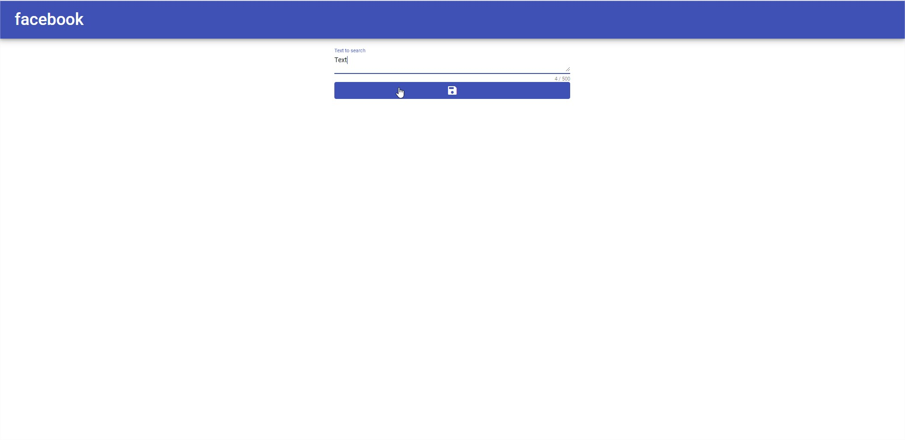

# Coruscant Web

### Set up dependencies before test
* Install Node 10+ (Required)
* Install Docker 19+ (Not required)
* Replace the value of the *urlEndPoint* variable within environments folder, you must replace it to use the correct one 

### How to test without Docker?

* Run `ng serve` after open `http://localhost:4200`

### How to test with Docker?

* Run `docker-compose up --build` after open `http://localhost`

### Docker commands
- *Start and update all services in Docker-compose file*: `docker-compose up --build -d`
- *Stop all services started*: `docker-compose down`

